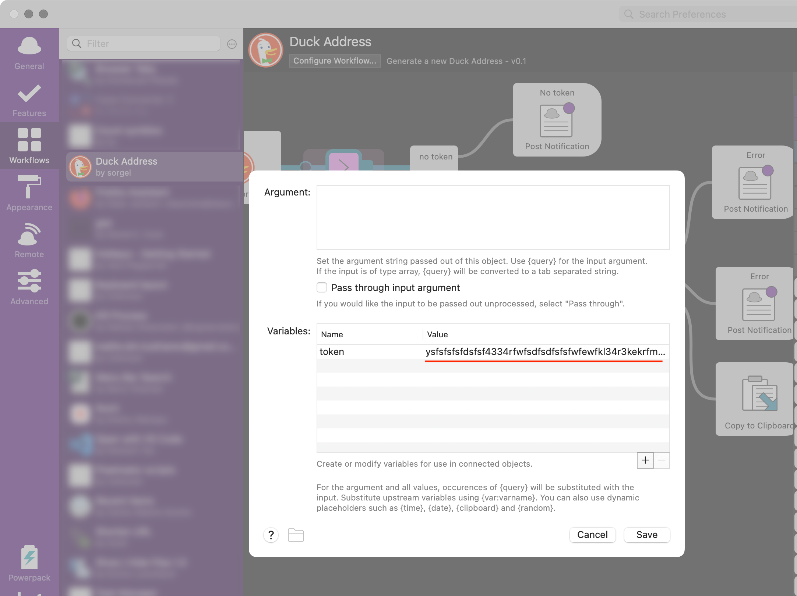

# The Duck Address Workflow
Alfred workflow that generates email addresses with the DuckDuckGo Email Protection:

> DuckDuckGo Email Protection is a free email forwarding service that removes multiple types of hidden email trackers and lets you create unlimited unique private email addresses on the fly.

Typically, users need to have the DuckDuckGo extension installed on their web browser in order to receive a new protected address. This workflow helps to get a new address in any app:

[Download workflow](https://github.com/kkhrv/Duck-Address-workflow/raw/main/workflow/Duck%20Address.alfredworkflow)

# Usage
Workflow uses the DuckDuckGo API. Provide an API token to make it work:
1. Follow [the DuckDuckGo instructions](https://duckduckgo.com/email) to setup your Duck Address.
2. On the Autofill tab on [the DuckDuckGo email protection page](https://duckduckgo.com/email/settings/autofill) open your web browser's developer tools.
3. Click the Generate Private Duck Address button and view the Network tab on your developer tools window.
4. Select the "Addresses" call for the API POST request. The item will look like this: `authorization: Bearer <API token>`.
5. In workflow settings, add the token to `Arg and Vars` object:
   

# Known issues
If a token is overused, DuckDuckGo may block it for a period of 24 hours. In this instance, the API consistently returns the same Private Address.
